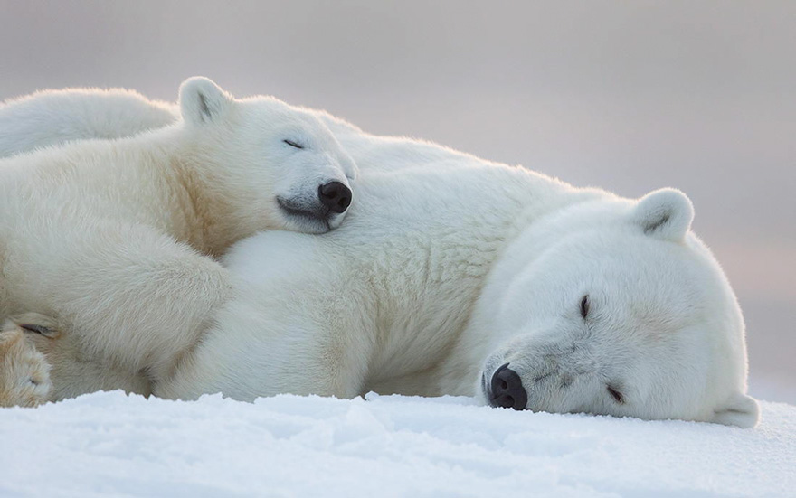

<html>
<head>
  <title>bear castle</title>
  <link href='bootstrap-3.3.7-dist/css/bootstrap.css' rel='stylesheet'> 

<meta name="viewport" content="width=device-width, initial-scale=1.0"> 
</head>

<body>

  
  

    <h1>Welcome to bear castle</h1>

<HEAD>

    

    <form role='form'>
      <label for="email">Find out more</label>
      <input type="text" name="email" >
      <button class="btn btn-lg btn-success" type="submit">Send</button>
    </form>

    
  

    

  

    <h2><small>The Buzz</small> What are people saying?</h2>
    
  

    

    
      
Polar bears are so cute!

      <small>piggy said</small>
    

    
    

  

      
      
we all love bear!

      <small>little song said</small>
    

   
    

  

      
      
let's play together!

    
 
    

  

    <h2><small>Our mission</small> Join us in helping bears</h2>

    
we believe people loving bears are good people!

    
let's join us!

    

      <button class="btn-twitter">Twitter</button>
      <button class="btn-facebook">Facebook</button>
      <button class="btn-pinterest">Pinterest</button>
    

  

</body>

<!-- Sandwich from: © Kosoff | <a href="http://www.dreamstime.com/">Dreamstime Stock Photos</a> & <a href="http://www.stockfreeimages.com/">Stock Free Images</a> -->
</html>

