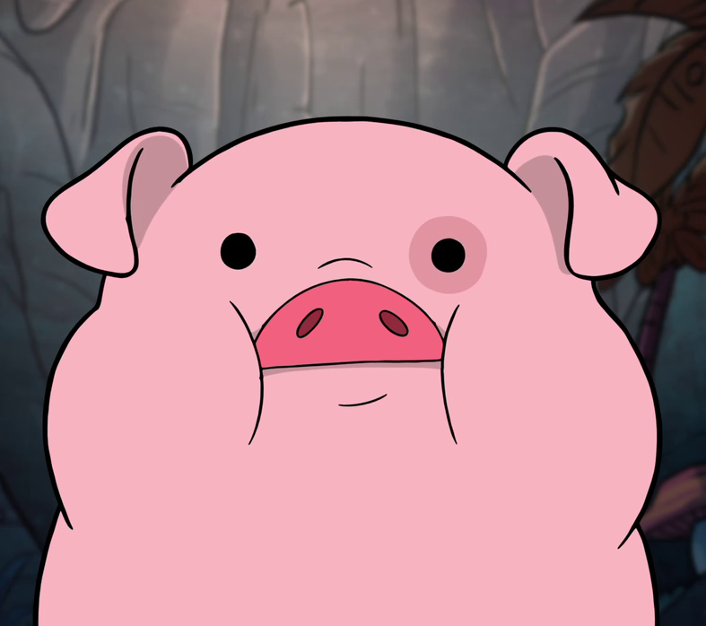
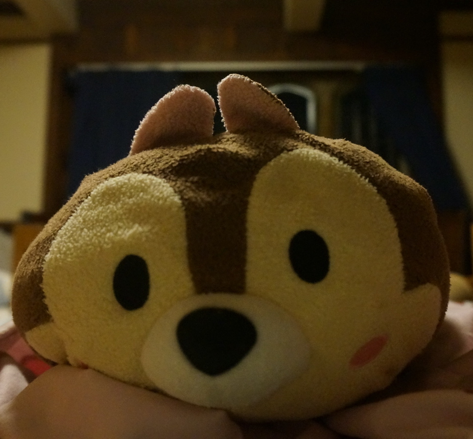
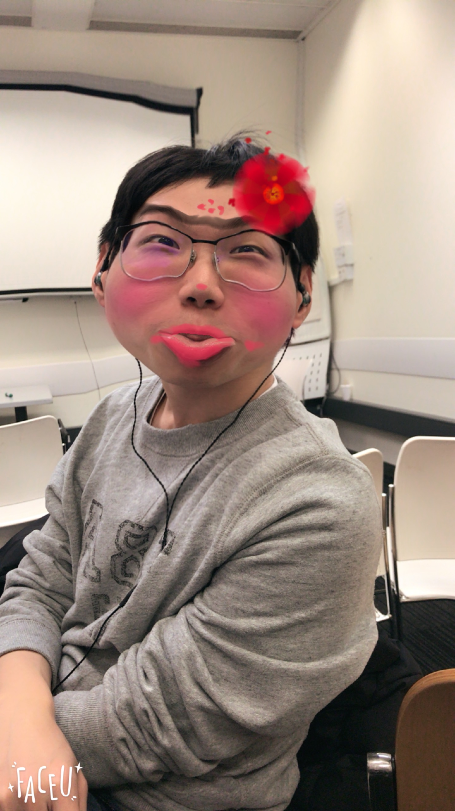

<html>
<head>
  <title>bear castle</title>
  <link href='bootstrap-3.3.7-dist/css/bootstrap.css' rel='stylesheet'> 

<meta name="viewport" content="width=device-width, initial-scale=1, maximum-scale=1, user-scalable=no">

</head>

<body>

  
  

    <h1>Welcome to bear castle</h1>

    

    

  <button class="tablinks" onclick="openCity(event, 'London')">London</button>
  <button class="tablinks" onclick="openCity(event, 'Paris')">Paris</button>
  <button class="tablinks" onclick="openCity(event, 'Tokyo')">Tokyo</button>
 

 

  <h3>London</h3>
  
London is the capital city of England.

 

 

  <h3>Paris</h3>
  
Paris is the capital of France.
 
 

 

  <h3>Tokyo</h3>
  
Tokyo is the capital of Japan.

 

 

  

    <h2><small>The Buzz</small> What are people saying?</h2>
    
  

    

    
      
Polar bears are so cute!

      <small> --piggy</small>
    

    
    

  

      
      
we all love bear!

      <small> `--little song</small>
    

   
    

  

      
      
let's play together!

      <small> --little Ground</small>
    
 
   

  

    <h2><small>Our mission</small> Join us in helping bears</h2>

    
we believe people loving bears are good people!

    
let's do it together!

    

    <a class="btn-twitter" href="http://twitter.com">
      <button class="btn-twitter">Twitter</button>
      </a>
    <a class="btn-facebook" href="http://facebook.com">
      <button class="btn-facebook">Facebook</button>
      </a>
    <a class="btn-pinterest" href="https://uk.pinterest.com/">
      <button class="btn-pinterest">Pinterest</button>
      </a>
    

  

<!-- Sandwich from: © Kosoff | <a href="http://www.dreamstime.com/">Dreamstime Stock Photos</a> & <a href="http://www.stockfreeimages.com/">Stock Free Images</a> -->

